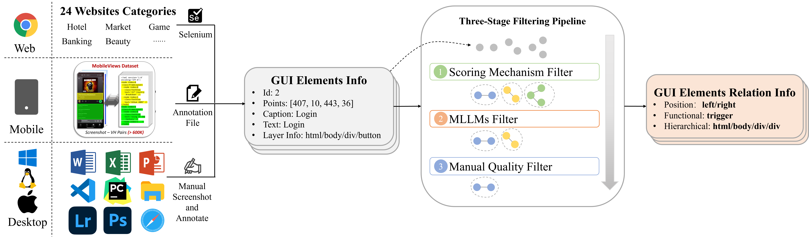

<div align="center">

# RelationGUI · RelationQA · RelationAgent

### Beyond Element-Level Understanding: Explicit Relational Understanding for GUI Agents

**Pattern Recognition, Volume 176, 113262 (2026)**

Longhui Ma · Di Zhao · Siwei Wang · Zhao Lv · Miao Wang

[](https://doi.org/10.1016/j.patcog.2026.113262)
[](https://huggingface.co/datasets/ahuiqqq/RelationGUI)

</div>

**RelationGUI** describes spatial, functional, and hierarchical relationships between GUI elements across desktop, mobile, and web interfaces. **RelationQA** evaluates functional relational reasoning through multiple-choice questions with marked screenshots and cropped views. **RelationAgent** learns grounding, relational understanding, and navigation in three successive stages.

## Release status

This repository contains the public data preparation, training, inference, and evaluation implementation. Code and documentation live on GitHub; packaged datasets belong on [Hugging Face](https://huggingface.co/datasets/ahuiqqq/RelationGUI).

**Updated release v2026.09** rebuilds and quality-filters the surviving source data. It corrects image metadata and grounding coordinates, removes invalid annotations, and excludes RelationQA source screenshots from every training task. The update contains **30,670 valid relation groups**, of which **28,093 are eligible for training**, and retains all **1,009 RelationQA questions**.

This updated version supersedes the unfiltered local exports; its counts and training instructions differ from the paper's original 37,724-sample version. The original desktop inclusion list has not been recovered, so this release does not claim an exact reconstruction of the historical experiment or reproduction of its reported scores. See [the release audit](docs/DATA_AUDIT.md). The validated archives are publicly available on [Hugging Face, release v2026.09](https://huggingface.co/datasets/ahuiqqq/RelationGUI/tree/v2026.09). Both remote archive hashes match the published SHA256SUMS.

## Overview



*Figure 2 from the paper: the cross-platform data collection and annotation pipeline of RelationGUI.*

The functional taxonomy contains **trigger**, **complement**, **parallel**, and **none**. RelationQA uses top-1 exact-match accuracy. The paper reports **49.7% RelationQA accuracy** and **79.2% ScreenSpot accuracy** for RelationAgent; these are published results, not new runs of this release.

| Platform | Relation samples reported in the paper |
|---|---:|
| Desktop | 6,854 |
| Mobile | 20,284 |
| Web | 10,586 |
| **Total** | **37,724** |

These counts must not be confused with the number of surviving source groups, generated SFT instructions, or filtered training records.

## Installation

Use Python 3.10+ and a CUDA-compatible PyTorch environment for model training and inference. The data builder and validator require Python 3.11+ and Pillow only.

```bash
git clone https://github.com/malonghui/RelationGUI.git
cd RelationGUI
python -m venv .venv
# Activate the environment, then:
pip install -r requirements.txt
```

The requirements select a Qwen2.5-VL-compatible Transformers 4.x stack. No GPU training run has been performed for this release. Install the PyTorch wheel matching your CUDA runtime if necessary. Image-token memory depends on screenshot resolution; the default microbatch is one example and gradient accumulation produces an effective batch size of eight.

## Dataset layout

Download the two archives from Hugging Face and extract them under `data/`. The dataset repository contains a checksum file and a data card explaining this updated version.

```bash
hf download ahuiqqq/RelationGUI --repo-type dataset --revision v2026.09 --local-dir downloads \
  --include "*.zip" --include "SHA256SUMS"
python -m zipfile -e downloads/RelationGUI-cleaned.zip data
python -m zipfile -e downloads/RelationQA-cleaned.zip data
```

The `hf` command is provided by `huggingface_hub`. You can also download the same files through the Hugging Face website.

```text
data/
├── RelationGUI/
│   ├── annotations.jsonl       # Source groups with explicit train/benchmark_source tags
│   ├── images/
│   ├── train/
│   │   ├── grounding.jsonl
│   │   ├── referring.jsonl
│   │   └── relation.jsonl
│   └── audit/
└── RelationQA/
    ├── annotations.jsonl       # All 1,009 original questions and gold labels
    ├── images/                 # Original, red-box marked, and cropped inputs
    ├── source_exclusions.jsonl
    └── audit.json
```

Images use paths relative to their dataset directory. Source groups tagged `benchmark_source` are retained for annotation provenance but **must not be used for training**. Every generated training file excludes all 350 RelationQA source screenshots and exact decoded-pixel matches. We do not introduce a new dev/test split into the paper's 1,009-question benchmark.

```bash
python tools/validate_release.py --root data
```

## Training

The default recipe follows Section 5.1 of the paper:

| Stage | Learning rate | Epochs | LoRA rank / alpha | Effective batch |
|---|---:|---:|---:|---:|
| Grounding | 1e-4 | 1 | 32 / 16 | 8 |
| Relation | 1e-4 | 1 | 32 / 16 | 8 |
| Navigation | 2e-5 | 2 | 128 / 256 | 8 |

The implementation masks prompt tokens from the loss and rejects sequences exceeding the configured context length instead of truncating image tokens. Each stage saves its adapter; merge it into the model before starting the next stage:

```bash
python train.py --stage grounding --data data/RelationGUI/train/grounding.jsonl \
  --image-root data/RelationGUI --output runs/grounding

python merge_adapter.py --adapters runs/grounding --output runs/grounding-merged

python train.py --stage relation --model runs/grounding-merged \
  --data data/RelationGUI/train/relation.jsonl --image-root data/RelationGUI \
  --output runs/relation

python merge_adapter.py --model runs/grounding-merged \
  --adapters runs/relation --output runs/relation-merged
```

The paper supplements grounding data with filtered UGround and uses Mind2Web for navigation. These external datasets and the historical UGround selection are not included here. Obtain them from their original providers. The navigation trainer accepts JSONL with `instruction`, `output`, and a list of relative `images` paths, using only training-partition examples:

```bash
python train.py --stage navigation --model runs/relation-merged \
  --data data/mind2web/train.jsonl --image-root data/mind2web \
  --output runs/navigation
```

The cleaned relation builder emits separate spatial, functional, and hierarchical instructions from accepted source groups. This is a documented rebuild choice; the surviving combined legacy training file contains functional instructions and synthetic negatives. The original experiment selection is not established by that file. Model checkpoints are not included.

## RelationQA evaluation

Inference uses the **red-box marked screenshot and crop**, and asks the model to return exactly one of the four labels. Gold answers are never included in the model prompt.

```bash
python infer_relationqa.py --model runs/relation-merged \
  --data-root data/RelationQA --output outputs/relationqa.jsonl

python evaluate_relationqa.py --annotations data/RelationQA/annotations.jsonl \
  --predictions outputs/relationqa.jsonl
```

Each prediction line is `{"id": "<benchmark ID>", "prediction": "trigger"}`. The scorer matches strings exactly: missing, invalid, differently capitalized, or punctuated labels count as incorrect. Unknown and duplicate IDs are rejected. Scores include overall accuracy, per-platform and per-label accuracy, and coverage. The supplied inference prompt is a public baseline; it is not asserted to be the exact historical prompt for every model in the paper.

## Rebuilding and testing

The builder operates on the author's source-tree layout (`data/dataset/all` and `data/benchmark/relationqa`). It never edits the source files. This step is for auditing the source corpus; ordinary users can consume the packaged data directly.

```bash
python tools/build_release.py --source /path/to/source-tree --output /path/to/empty-output --pack
python tools/validate_release.py --root /path/to/empty-output
python -m unittest discover -s tests -v
```

## Citation

```bibtex
@article{ma2026relationgui,
  title   = {Beyond element-level understanding: Explicit relational understanding for GUI agents},
  author  = {Ma, Longhui and Zhao, Di and Wang, Siwei and Lv, Zhao and Wang, Miao},
  journal = {Pattern Recognition},
  volume  = {176},
  pages   = {113262},
  year    = {2026},
  doi     = {10.1016/j.patcog.2026.113262}
}
```

## Acknowledgements

We thank the authors of [Qwen2.5-VL](https://github.com/QwenLM/Qwen2.5-VL), [MobileViews](https://huggingface.co/datasets/mllmTeam/MobileViews), [Mind2Web](https://github.com/OSU-NLP-Group/Mind2Web), [UGround](https://github.com/OSU-NLP-Group/UGround), and [ScreenSpot / SeeClick](https://github.com/njucckevin/SeeClick). Third-party data and model terms remain applicable; no new license for third-party screenshots is asserted by this repository.
